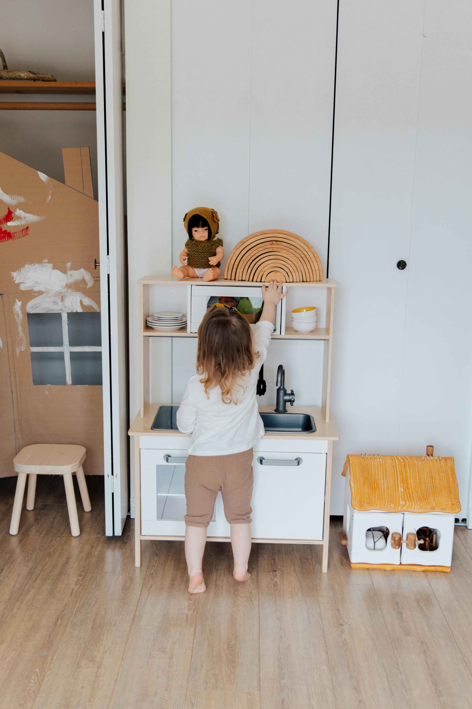
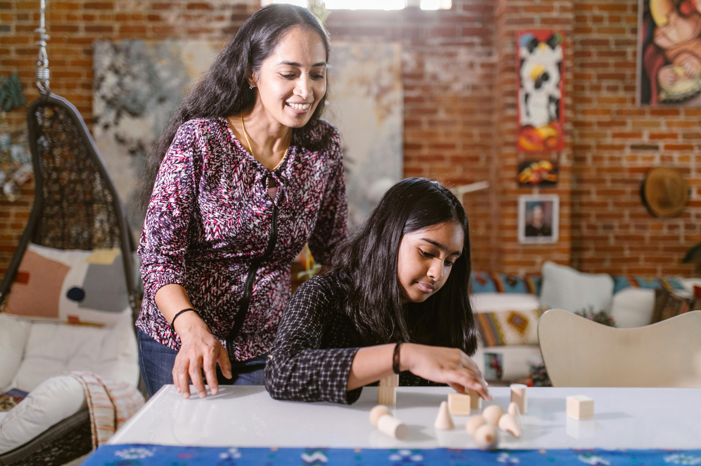

### Adaptando el Método Montessori en el Hogar

El Método Montessori, conocido por su enfoque centrado en el niño y su énfasis en el aprendizaje autodirigido, puede ser implementado de manera efectiva en el entorno del hogar. Adaptar los principios Montessori en casa no solo fomenta el desarrollo integral del niño, sino que también crea un ambiente propicio para el aprendizaje activo y la exploración independiente desde una edad temprana.

#### Principios para Implementar el Método Montessori en Casa con Ejemplos Prácticos

1. **Ambiente Preparado:**
   Designar áreas específicas en casa donde los niños puedan acceder fácilmente a materiales educativos y actividades sensoriales adecuadas para su desarrollo. Por ejemplo, en una esquina tranquila de la sala, establezca una estantería baja con libros de imágenes, rompecabezas y juguetes sensoriales Montessori organizados en bandejas o cestas. Esto permite que los niños elijan libremente actividades que les interesen y las exploren a su propio ritmo.

2. **Autonomía y Libertad:**
   Proporcionar opciones y permitir que los niños elijan actividades según sus intereses y capacidades, fomentando así la toma de decisiones autónomas. Por la mañana, por ejemplo, permita que su hijo elija entre preparar su cereal con frutas o yogurt para el desayuno. Esto no solo fomenta la independencia, sino que también enseña habilidades prácticas como la preparación de alimentos y la toma de decisiones.

3. **Material Educativo Montessori:**
   Utilizar materiales Montessori como los cubos de construcción, rompecabezas sensoriales y libros de imágenes para estimular el aprendizaje activo y práctico. Introduzca un juego de construcción Montessori con cubos de diferentes tamaños y formas. Anime a su hijo a explorar cómo encajan las piezas y a crear sus propias estructuras, promoviendo así la creatividad y habilidades motoras finas.

4. **Rutinas y Consistencia:**
   Establecer rutinas diarias que promuevan la independencia, como preparar su propia merienda o participar en tareas domésticas adecuadas para su edad. Todos los días después de la escuela, anime a su hijo a limpiar su área de juego y guardar los juguetes en su lugar asignado. Esta rutina no solo enseña responsabilidad, sino que también mantiene el ambiente organizado y listo para nuevas actividades.

5. **Respeto por el Ritmo Individual:**
   Permitir que los niños aprendan a su propio ritmo y explorar temas que despierten su curiosidad, ofreciendo apoyo y orientación cuando sea necesario. Si su hijo muestra interés en los animales marinos después de una visita al acuario, proporcione libros y actividades relacionadas con el tema. Anime las preguntas y la investigación independiente, apoyando así su interés natural por aprender más sobre el tema.

### Reflexión Final

   
   
Adaptar el Método Montessori en casa no solo enriquece el entorno educativo del niño, sino que también fortalece los lazos familiares al involucrar a los padres en el proceso de aprendizaje activo y autodirigido. Al seguir estos principios y utilizar recursos Montessori adecuados, los padres pueden crear un ambiente de aprendizaje estimulante que promueva el desarrollo integral de sus hijos.

#### Referencias Bibliográficas

- Montessori, Maria. *The Secret of Childhood*. Ballantine Books, 1982.
- Seldin, Tim. *How to Raise an Amazing Child the Montessori Way*. DK Publishing, 2006.

---
